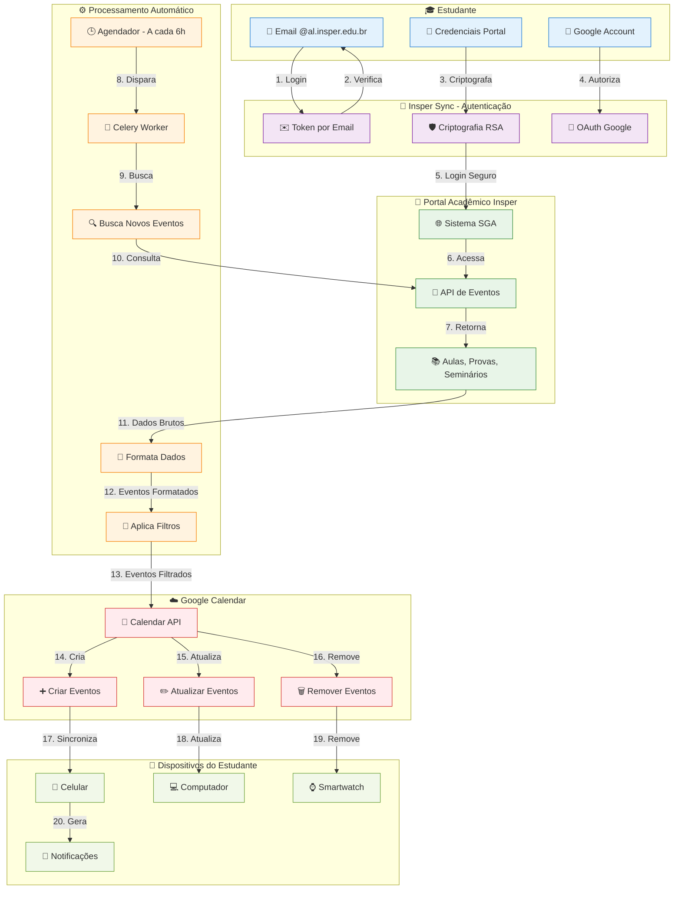

# 📅 Insper Sync

**Nunca mais perca uma aula, prova ou evento do Insper!**

## 🎯 O que é?

O **Insper Sync** é um serviço gratuito que sincroniza automaticamente seu calendário acadêmico do Insper com o Google Calendar. 

**Em outras palavras**: Suas aulas, provas e eventos aparecem automaticamente no calendário do seu celular, sem você precisar fazer nada! 📱✨

## ❓ Por que usar?

### Antes do Insper Sync:
- 😤 Ficar checando o portal acadêmico toda hora
- 📝 Copiar eventos manualmente para o seu calendário
- 😱 Descobrir que tinha prova só no dia
- 📱 Calendário vazio no celular

### Depois do Insper Sync:
- 🎉 Tudo aparece automaticamente no seu Google Calendar
- 📲 Notificações no celular sobre próximos eventos
- ⏰ Lembretes automáticos de provas e aulas
- 🔄 Sempre atualizado, sem esforço nenhum

## 🚀 Como funciona?

### É super simples:

1. **📧 Faça login** com seu email do Insper
2. **🔑 Configure** suas credenciais do portal (100% seguro!)
3. **🔗 Conecte** com seu Google Calendar
4. **✨ Pronto!** Seus eventos aparecem automaticamente

## 🛡️ É seguro?

**Absolutamente!** Sua segurança é nossa prioridade:

- 🔐 **Criptografia militar**: Sua senha é criptografada com a chave oficial do Insper
- 👀 **Nem nós vemos sua senha**: Impossível para qualquer pessoa acessar
- 🎓 **Só estudantes**: Apenas emails @al.insper.edu.br são aceitos
- 🗑️ **Controle total**: Você pode deletar tudo a qualquer momento

## ⚡ Funcionalidades Incríveis

### 🎨 **Personalizável**
- Escolha quais tipos de eventos sincronizar
- Adicione ou remova o prefixo "[Insper]"
- Configure a frequência de atualização

### 📊 **Inteligente**
- Detecta automaticamente mudanças de horário
- Remove eventos cancelados
- Atualiza informações de professores e salas

### 📱 **Funciona em tudo**
- Celular Android e iPhone
- Tablet e computador
- Apple Watch e smartwatches
- Qualquer app que use Google Calendar

## 🎯 Perfeito para:

- **📚 Calouros**: Que ainda estão se organizando
- **🎓 Veteranos**: Que querem mais praticidade  
- **📱 Viciados em tecnologia**: Que amam automação
- **🤯 Esquecidos**: Que vivem perdendo prazos
- **📅 Organizados**: Que querem tudo centralizado

## 📱 Como começar?

É literalmente mais fácil que pedir um Uber:

1. **Acesse**: [sync.insper.dev](https://sync.insper.dev)
2. **Digite**: Seu email @al.insper.edu.br
3. **Confirme**: Token enviado por email
4. **Configure**: Credenciais do portal (super seguro)
5. **Conecte**: Seu Google Calendar
6. **🎉 Pronto!**: Relaxa e deixa a mágica acontecer

## ❓ Dúvidas Frequentes

<strong>💰 É realmente gratuito?</strong>

Sim! 100% gratuito, sem pegadinhas. É um projeto feito por estudantes para estudantes.

<strong>🔒 Minha senha está segura?</strong>

Mais segura que no próprio Insper! Usamos criptografia militar e nem nós conseguimos ver sua senha.

<strong>📱 Funciona no iPhone?</strong>

Perfeitamente! Funciona em qualquer dispositivo que tenha Google Calendar.

<strong>⏰ Com que frequência atualiza?</strong>

A cada 6 horas por padrão, mas você pode configurar de 1 hora até 1 dia.

<strong>🗑️ Como cancelo?</strong>

Super fácil! Basta entrar no painel e clicar em "Deletar conta". Tudo é removido instantaneamente.

## 🆘 Precisa de ajuda?

- **💬 Dúvidas**: [fa@insper.dev](mailto:fa@insper.dev)
- **🐛 Problemas**: [Reportar aqui](https://github.com/felipeadeildo/insper-sync/issues)
- **💡 Sugestões**: Manda um email que adoramos feedback!

---

**🎓 Feito por estudantes, para estudantes do Insper**

**[🚀 Começar agora - É grátis!](https://sync.insper.dev)**

*Não é afiliado oficialmente ao Insper*

